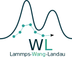

<p align="center">
  
</p>

<h1 align="center">LAMMPS Wang-Landau</h1>

<p align="center">This repo contains a implementation of the Wang-Landau enhanced sampling (Monte Carlo) algorithm for use within <a href="www.lammps.org">LAMMPS</a>.</p>

<p align="center">
  <a href="https://github.com/pstaerk/lammps_wang_landau/actions/workflows/build.yml">
    
  </a>
</p>

---

## Quick Start

```bash
# 1. Clone LAMMPS patch_22Dec2022
git clone https://github.com/lammps/lammps.git -b patch_22Dec2022

# 2. Copy fix sources
cp src/lammps/MC/* lammps/src/MC/

# 3. Build with MC package
cd lammps && make yes-MC && make mpi

# 4. Run example
cd ../lammps_wang_landau/examples/lj
mpirun -np 4 lammps -in in.wang_landau
```

## Documentation

Full docs at [pstaerk.github.io/lammps_wang_landau](https://pstaerk.github.io/lammps_wang_landau/)

## Citation

```bibtex
@article{stark26a,
  title   = {Phase Diagram and Criticality of the Modified Primitive Electrolyte Model in Bulk and in Inert and Conducting Confinement},
  author  = {St{\"a}rk, P. and Schlaich, A.},
  year    = {2026},
  journal = {The Journal of Chemical Physics},
  volume  = {164},
  number  = {6},
  pages   = {064507},
  doi     = {10.1063/5.0314875}
}

@misc{stark26b,
  title   = {Replication Data for: Phase Diagram and Criticality of the Modified Primitive Electrolyte Model in Bulk and in Inert and Conducting Confinement},
  author  = {St{\"a}rk, P. and Schlaich, A.},
  year    = {2026},
  publisher = {DaRUS},
  doi     = {10.18419/DARUS-5037}
}
```
