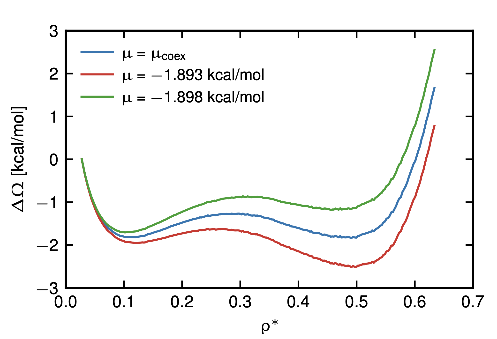

# Wang-Landau Method

The Wang-Landau method[^1] is an extension of Monte-Carlo sampling that allows one to estimate the density of states $g(X)$ along a chosen reaction coordinate $X$.

In the original formulation of the algorithm, the reaction coordinate was the system's potential energy. In the implementation described in this documentation, the reaction coordinate is instead the particle number,

$$X = N.$$

## Density of States

The Wang-Landau algorithm estimates the density of states $g(N)$ for a system with $N$ particles.

Once $g(N)$ is known, a large amount of thermodynamic information becomes available. In particular, it is directly related to the [Helmholtz free energy](https://en.wikipedia.org/wiki/Helmholtz_free_energy) via

$$F(N) = -k_B T \ln g(N) + c,$$

where $c$ is a constant offset (depends on the definition of phase space volumes, but is usually irrelevant).
From thermodynamics, the equilibrium state of the system corresponds to the minimum of the free energy.

For [Grand-Canonical](https://en.wikipedia.org/wiki/Grand_canonical_ensemble) systems, which can exchange particles with an external reservoir, it is often more convenient to work with the grand potential, sometimes also called the "[Landau free energy](https://en.wikipedia.org/wiki/Grand_potential)". It is obtained via a Legendre transform:

$$\Omega(N, \mu) = F(N) - \mu N.$$

This formulation makes it straightforward to determine the equilibrium particle number in a simulation domain: since Wang-Landau sampling provides $F(N)$ over a range of $N$, the equilibrium state $N_{\mathrm{eq}} (\mu)$ for any chemical potential $\mu$ can be obtained by minimizing $\Omega(N)$, i.e. via

$$
N_{\mathrm{eq}}(\mu) = \min_N \Omega(N, \mu).
$$

As an example, we show in the figure below a typical output of the Wang-Landau
sampling model for a simple model fluid with phase coexistence between a low-
density vapor and high-density fluid phase[^2][^3][^4].

<figure markdown>
  { width=60% }
  <figcaption>Example output of the Wang-Landau sampling method for a charged Lennard-Jones fluid: the Landau free energy of a fluid with phase coexistence between a liquid and a vapor phase, see [2,3,4].</figcaption>
</figure>

In the following, we briefly describe the main ideas behind the method by presenting the algorithm.

## Algorithm

The main idea behind the method, as is nicely summarized in the original paper[^1], is to assume that the true density of states $g(N)$ is known.

If this were the case, one could introduce a bias into [Markov Chain Monte Carlo](https://en.wikipedia.org/wiki/Markov_chain_Monte_Carlo) sampling in order to obtain uniform sampling along the reaction coordinate.

More concretely, if $g(N)$ were known, the acceptance probability for a proposed Monte Carlo move from particle number $N$ to $N'$ can be modified by the factor

$$\frac{g(N)}{g(N')} , p_{N \to N'},$$

which results in a uniform probability of visiting each state $N$.

The resulting simulation would therefore perform a random walk in particle number space.

The problem, of course, is that $g(N)$ is the quantity we want to determine and is not known a priori. The goal of the method is therefore to construct an estimate of $g(N)$ iteratively, with the idea that a flat histogram corresponds to a good approximation of the true density of states.

Wang-Landau sampling achieves this using multiple iterations indexed by $i$. Each iteration refines the estimate of $g(N)$.

This procedure is often described as “filling the free-energy landscape with sand”: regions that are visited frequently are gradually suppressed, while rarely visited regions are enhanced.

There are two coupled iterative processes:

* a fast inner loop corresponding to the Monte Carlo sampling with a fixed modification factor,
* and a slower outer loop in which this modification factor is gradually reduced, leading to increasingly accurate estimates of $g(N)$.

### Updates that are performed per iteration $i$

We track two quantities: a histogram $h(N)$ and an estimate $Q(N) = \ln g(N)$, both functions of particle number $N$.

We define a sampling window
$N \in [N_{\min}, N_{\max}]$
within which all sampling is restricted.

We also introduce a modification factor $f_i > 1$, which is large in early iterations and is gradually reduced as $i$ increases.

For each visit to a state $N$ (i.e. each Monte Carlo step that produces a statistically decorrelated configuration), we update:

* $h(N) \to h(N) + 1$, recording the visitation histogram
* $Q(N) \to Q(N) + \ln f_i$, updating the estimate of $\ln g(N)$ via $Q(N) \approx \ln g(N)$

### Stopping criterion for iteration $i$

As state above, the idea is to sample until we observe that the method converges
to even sampling in the particle number $N$, i.e. until the observed histogram
$h(N)$ is "sufficiently flat".
Exactly what constitutes sufficient flatness is, of course, up for debate.
A commonly useful stopping criterion can be based on an analysis due to [^2], where the authors investigate the evolution of the error with the number of visits to each state.
They show that the numerical noise of the method scales with
$\propto \sqrt{h(N) f_i}$, once the sampling is close to convergence.

It is thus sensible to use
$$
h(N) \ge \frac{A}{\sqrt{\ln{f_i}}}, \forall N \in [N_{\mathrm{min}}, N_{\mathrm{max}}]
$$
as a stopping criterion, with $A$ some factor representing the number of 
measurements.
This parameter $A$ is thus an method specific parameter, which should be chosen
as small as possible, but large enough to guarantee enough independent
updates of $Q(N)$.
In the implementation published here, we call $A$ `accuracy`, which defaults to
$A = 500$, which is a good default value for simple model systems such as 
Lennard-Jones fluids.
For molecular systems, where the convergence is slower (due to a smaller
acceptance probability) or higher density systems, this factor might be required
to be higher.

### Updates performed between iterations

Between indidivual, global Wang-Landau iterations, we have to take care of the
following:

 - Keep the current estimate for the DOS $Q(N)$
 - Decrease the magnitude of the updates by making $f_i$ smaller
 - Reset the histogram $h(N)$

We recommend the following procedure for updating $f$ between runs:

$$f_{i} = \sqrt{f_{i-1}} = f_0^{2^{-i}}$$

A reasonable starting value for medium density Lennard-Jones fluids
for the very first Wang-Landau run is $f_0 = \exp(4)$.

Thus, for setting up the simulation run for a single Wang-Landau iteration, we
have to determine the following parameters.

| Parameter | Recommended Value | Description |
|-----------|-------------------|-------------|
| `f` | $f_0 = \exp(4), f_i = f_0^{2^{-i}}$ | DOS update factor per visit |
| `accuracy` | 500 | Accuracy factor for stopping criterion  |

[^1]: Wang, F. G. & Landau, D. P. [Efficient, Multiple-Range Random Walk Algorithm to Calculate the Density of States](https://doi.org/10.1103/PhysRevLett.86.2050). *Phys. Rev. Lett.* **86**, 2050–2053 (2001).
[^2]: Zhou, C.; Bhatt, R. N. [Understanding and Improving the Wang-Landau Algorithm](https://doi.org/10.1103/PhysRevE.72.025701). *Phys. Rev. E* **72**, 025701. (2005).
[^3]: Stärk, P. [Consistent Modeling of Electrostatic Interactions in Confined Electrode Systems: Thermodynamic Behavior and Macroscopic Properties from Atomistic Simulations](https://doi.org/10.18419/opus-18179). (2026).
[^4]: Stärk, P.; Schlaich, A. [Phase Diagram and Criticality of the Modified Primitive Electrolyte Model in Bulk and in Inert and Conducting Confinement](https://doi.org/10.1063/5.0314875). *J. Chem. Phys.* **164** (6), 064507. (2026).